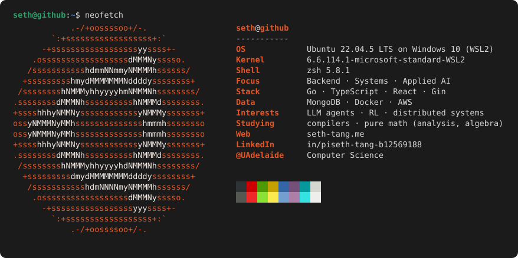

<!--
  Put BOTH files in a repo named exactly after your username:  pisethTang/pisethTang
  (GitHub renders that repo's README on your profile.)
    - README.md   (this file)
    - neofetch.svg
  Commit both, and the colored fetch below renders in full color on your profile.
-->

> **What is computation?** - building the compiler in my head, one abstraction at a time.

---

<!--
  Streak card via the maintained demolab endpoint (more reliable than the old heroku one).
  NOTE: the anuraghazra github-readme-stats "stats" + "top-langs" cards were removed because
  the public instance (github-readme-stats.vercel.app) is paused/rate-limited and renders as a
  broken image. If you want the top-languages card back, self-host that project on your own
  Vercel and swap the URL — see the chat for steps.
-->

<!--  -->

 

<!-- Contribution snake — generated by your .github/workflows/snake.yml onto the `output` branch -->
<picture>
  <source media="(prefers-color-scheme: dark)"  srcset="https://raw.githubusercontent.com/pisethTang/pisethTang/output/github-snake-dark.svg" />
  <source media="(prefers-color-scheme: light)" srcset="https://raw.githubusercontent.com/pisethTang/pisethTang/output/github-snake.svg" />
  
</picture>

---

  
    <a href="https://seth-tang.me">seth-tang.me</a> &nbsp;·&nbsp;
    <a href="https://www.linkedin.com/in/piseth-tang-b12569188/">linkedin</a> &nbsp;·&nbsp;
    @UAdelaide
  

